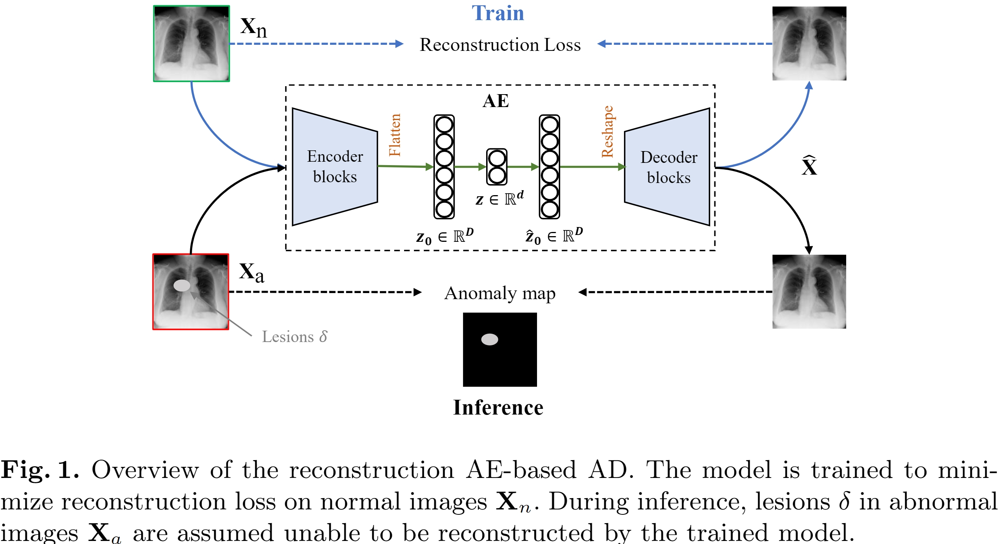

# Rethinking Autoencoders for Medical Anomaly Detection from A Theoretical Perspective

**The code for reproduction has been incorporated into our [benchmark repository](https://github.com/caiyu6666/MedIAnomaly?tab=readme-ov-file#reconstruction-based-methods).**


## Abstract
Medical anomaly detection aims to identify abnormal findings using only normal training data, playing a crucial role in health screening and recognizing rare diseases. Reconstruction-based methods, particularly those utilizing autoencoders (AEs), are dominant in this field. They work under the assumption that AEs trained on only normal data cannot reconstruct unseen abnormal regions well, thereby enabling the anomaly detection based on reconstruction errors. However, this assumption does not always hold due to the mismatch between the reconstruction training objective and the anomaly detection task objective, rendering these methods theoretically unsound. This study focuses on providing a theoretical foundation for AE-based reconstruction methods in anomaly detection. By leveraging information theory, we elucidate the principles of these methods and reveal that the key to improving AE in anomaly detection lies in minimizing the information entropy of latent vectors. Experiments on four datasets with two image modalities validate the effectiveness of our theory. To the best of our knowledge, this is the first effort to theoretically clarify the principles and design philosophy of AE for anomaly detection.


<p align="center"></p>

Overview of the reconstruction AE-based AD. The model is trained to minimize reconstruction loss on normal images $\mathbf{X}_n$. During inference, lesions $\delta$ in abnormal images $\mathbf{X}_a$ are assumed unable to be reconstructed by the trained model.


<p align="center"></p>

Venn diagram of $H(\mathbf{X}_n), H(\mathbf{X}_a), H(\mathbf{Z})$. (a) Relationship between $H(\mathbf{X}_n)$ and $H(\mathbf{X}_a)$; (b) $H(\mathbf{Z})$ of an AE w/o latent constraints; (c) $H(\mathbf{Z})$ of an optimal AE.


## Results

<p align="center"></p>

<p align="center"></p>


## Cite

```
@article{cai2024rethinking,
  title={Rethinking Autoencoders for Medical Anomaly Detection from A Theoretical Perspective},
  author={Cai, Yu and Chen, Hao and Cheng, Kwang-Ting},
  journal={arXiv preprint arXiv:2403.09303},
  year={2024}
}
```